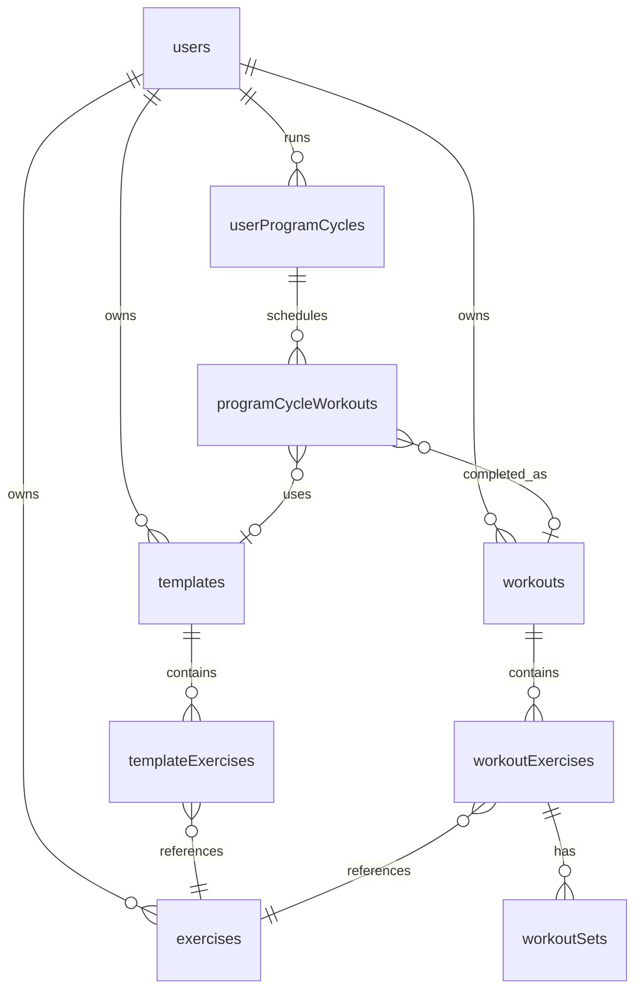

# LLM/Agent Readability Improvements Plan

This document outlines improvements to make the codebase more accessible and navigable for LLM/AI agents.

## Goal
Reduce the time and context required for an LLM to understand, navigate, and contribute to the codebase.

---

## 1. JSDoc Comments for Repository Functions

**Status:** Pending  
**Priority:** High  
**Effort:** Medium

### Problem
Repository functions in `src/lib/db/` lack parameter and return documentation, making it hard for LLMs to understand function signatures and behavior.

### Files to Update
- `src/lib/db/exercise.ts`
- `src/lib/db/workout.ts`
- `src/lib/db/template.ts`
- `src/lib/db/program.ts`
- `src/lib/db/template/repository.ts`
- `src/lib/db/workout/repository.ts`
- `src/lib/db/local-db.ts`
- `src/lib/db/local-repository.ts`
- `src/lib/db/preferences.ts`
- `src/lib/db/user.ts`

### Template
```typescript
/**
 * Creates a new exercise for a user
 * @param db - D1 database instance
 * @param data - Exercise creation data including workosId
 * @returns The created exercise with all fields populated
 * @throws Will throw if database operation fails
 */
export async function createExercise(...)
```

### Implementation
```bash
# Run this command to see current coverage
grep -r "export async function" src/lib/db/*.ts src/lib/db/*/*.ts | wc -l
```

---

## 2. Document Offline-First Architecture

**Status:** Pending  
**Priority:** High  
**Effort:** Low

### Problem
The codebase has complex offline sync logic (local-db.ts, sync-engine.ts) but no centralized documentation explaining the architecture.

### Files to Document
- `src/lib/db/local-db.ts`
- `src/lib/db/local-repository.ts`
- `src/lib/sync/sync-engine.ts`

### Recommended Location
Add to AGENTS.md under new section OR create `docs/OFFLINE.md`

### Content Structure
```markdown
## Offline-First Architecture

### Data Flow
1. Client creates data → stored in IndexedDB (Dexie)
2. Data marked as `syncStatus: 'pending'`
3. When online → sync to remote D1
4. Conflict resolution → uses last-write-wins with timestamp

### Key Files
- `local-db.ts` - IndexedDB wrapper and schema
- `local-repository.ts` - Offline CRUD operations
- `sync-engine.ts` - Sync logic and conflict resolution

### Important Patterns
- Never write directly to D1 when offline
- Always check `syncStatus` before operations
- Use `localId` for offline records, `id` for synced records
```

---

## 3. Create COMPONENTS.md

**Status:** Pending  
**Priority:** Medium  
**Effort:** Low

### Purpose
Centralize UI component patterns and conventions.

### Recommended Location
`docs/COMPONENTS.md` with reference in AGENTS.md

### Content Structure
```markdown
# Component Documentation

## UI Component Library
All UI components use Radix UI primitives under the hood.

## Pattern: CVA Variants
```typescript
const buttonVariants = cva("base-styles", {
  variants: {
    variant: { primary: "...", secondary: "..." },
    size: { sm: "...", md: "...", lg: "..." }
  }
});
```

## Pattern: Compound Components
Dialog, Select, Drawer use compound component pattern.

## Icon Usage
Use Lucide React icons:
```tsx
import { Plus, Trash, Edit } from 'lucide-react';
```

## File Locations
- Primitive components: `src/components/ui/`
- Feature components: `src/components/{feature}/` (achievements, dashboard, progress, workouts)
- Shared layouts: `src/components/PageLayout.tsx`
```

---

## 4. Standardize Repository Structure

**Status:** Pending  
**Priority:** Low → **Recommend: SKIP**
**Effort:** Medium

### Recommendation
**Do not migrate.** The inconsistency is minor and migration would:
- Break many imports across the codebase
- Risk introducing bugs
- Provide minimal LLM benefit vs. good JSDoc on existing files

Instead: Add good JSDoc to all repository files and document the two patterns in AGENTS.md.

---

## 5. Create Constants Reference

**Status:** Pending  
**Priority:** Low  
**Effort:** Low

### Problem
Important constants are scattered across files or hardcoded.

### Solution
Create `src/lib/constants.ts`:
```typescript
export const CONSTANTS = {
  // Limits
  MAX_EXERCISES_PER_WORKOUT: 50,
  MAX_SETS_PER_EXERCISE: 20,
  MAX_TEMPLATE_NAME_LENGTH: 100,
  
  // Defaults
  DEFAULT_WEIGHT_UNIT: 'kg',
  DEFAULT_REPS: 10,
  DEFAULT_SETS: 3,
  
  // Sync
  SYNC_DEBOUNCE_MS: 1000,
  OFFLINE_QUEUE_MAX_SIZE: 1000,
  
  // Pagination
  DEFAULT_PAGE_SIZE: 20,
  MAX_PAGE_SIZE: 100,
} as const;
```

### Update Strategy
1. Create file
2. Replace inline constants with imports
3. Document each constant with JSDoc

---

## 6. Add Error Code Reference

**Status:** Pending  
**Priority:** Medium  
**Effort:** Low

### Purpose
Document common error responses for API consistency.

### Recommended Location
`docs/API_ERRORS.md` or add to AGENTS.md

### Content
```markdown
## Error Response Format
All API errors follow this format:
```typescript
{ error: string; code: string; details?: unknown }
```

## Error Codes
| Code | HTTP Status | Meaning | Common Cause |
|------|-------------|---------|--------------|
| NOT_AUTHENTICATED | 401 | No valid session | Token expired |
| NOT_FOUND | 404 | Resource doesn't exist | Invalid ID |
| CONFLICT | 409 | Duplicate entry | Same localId exists |
| INVALID_BODY | 400 | Schema validation failed | Missing required field |
| DB_ERROR | 500 | Database operation failed | Connection issue |

## Error Handling Pattern
```typescript
try {
  await db.insert(...).values(...);
} catch (error) {
  if (error.code === 'SQLITE_CONSTRAINT_UNIQUE') {
    throw new ApiError('CONFLICT', 'Resource already exists');
  }
  throw new ApiError('DB_ERROR', 'Database operation failed');
}
```
```

---

## 7. Database Index Guide

**Status:** Pending  
**Priority:** Low → **Recommend: SKIP**
**Effort:** Low

### Recommendation
**Not needed.** The schema.ts file already defines all indexes inline (lines 168-216). An LLM can read this directly. Instead, add a comment block at the top of the index definitions section:

```typescript
// ============================================
// DATABASE INDEXES
// All indexes are defined below for query optimization.
// Naming: _tableName + ColumnName(s) + Idx
// ============================================
```

---

## 8. Add Route Index Document

**Status:** Pending  
**Priority:** Low → **Recommend: SKIP**
**Effort:** Low

### Recommendation
**Not needed.** TanStack Start uses file-based routing. The route structure is self-documenting from `src/routes/` directory listing. LLMs can infer routes from filenames:
- `exercises._index.tsx` → `/exercises`
- `exercises.$id.tsx` → `/exercises/:id`

AGENTS.md already documents the routing convention.

---

## 9. Migration History Document

**Status:** Pending  
**Priority:** Low → **Recommend: SKIP**
**Effort:** Low

### Recommendation
**Not needed.** Migration history belongs in git commits and the `drizzle/` migrations folder. A separate doc would become stale. LLMs can read migration files directly.

---

## 10. Performance Guidelines

**Status:** Pending  
**Priority:** Low  
**Effort:** Low

### Purpose
Help LLMs write performant code.

### Recommended Location
Add to AGENTS.md under "## Performance Patterns"

### Content
```markdown
# Performance Guidelines

## Database Queries

### Prefer `.get()` for single records
```typescript
// Bad - returns array with one element
const result = await db.select().from(users).where(eq(users.id, id));

// Good - returns single object
const user = await db.select().from(users).where(eq(users.id, id)).get();
```

### Use `.limit()` for pagination
```typescript
const workouts = await db
  .select()
  .from(workouts)
  .where(eq(workouts.workosId, workosId))
  .orderBy(desc(workouts.startedAt))
  .limit(20)
  .offset(0);
```

### Avoid N+1 queries in templates
```typescript
// Bad - N+1 queries
for (const template of templates) {
  const exercises = await getTemplateExercises(template.id);
}

// Good - single query with join
const templatesWithExercises = await db
  .select({
    template: templates,
    exercises: templateExercises,
  })
  .from(templates)
  .leftJoin(templateExercises, eq(templates.id, templateExercises.templateId));
```

## React Performance

### Use `useMemo` for expensive computations
```typescript
const processedData = useMemo(() => {
  return data.filter(x => x.active).sort(byDate);
}, [data]);
```

### Use `React.memo` for large lists
```typescript
const WorkoutSet = React.memo(({ set }) => (
  <SetRow data={set} />
));
```
```

---

## NEW: 11. Add Schema Header Comments

**Status:** Pending  
**Priority:** High  
**Effort:** Low

### Problem
`src/lib/db/schema.ts` has 240 lines with no section headers. Hard for LLMs to navigate.

### Solution
Add section dividers:

```typescript
// ============================================
// CORE ENTITIES
// ============================================
export const users = sqliteTable('users', { ... });
export const userPreferences = sqliteTable('user_preferences', { ... });

// ============================================
// EXERCISE LIBRARY
// ============================================
export const exercises = sqliteTable('exercises', { ... });

// ============================================
// TEMPLATES (Workout Blueprints)
// ============================================
export const templates = sqliteTable('templates', { ... });
export const templateExercises = sqliteTable('template_exercises', { ... });

// ============================================
// WORKOUTS (Completed Sessions)
// ============================================
export const workouts = sqliteTable('workouts', { ... });
export const workoutExercises = sqliteTable('workout_exercises', { ... });
export const workoutSets = sqliteTable('workout_sets', { ... });

// ============================================
// GAMIFICATION & STREAKS
// ============================================
export const userStreaks = sqliteTable('user_streaks', { ... });

// ============================================
// PROGRAMS (Multi-Week Training Plans)
// ============================================
export const userProgramCycles = sqliteTable('user_program_cycles', { ... });
export const programCycleWorkouts = sqliteTable('program_cycle_workouts', { ... });

// ============================================
// DATABASE INDEXES
// ============================================
// ... existing indexes ...

// ============================================
// TYPE EXPORTS
// ============================================
// ... existing types ...
```

---

## NEW: 12. Add Validators Index

**Status:** Pending  
**Priority:** Medium  
**Effort:** Low

### Problem
AGENTS.md references `src/lib/validators/` but this directory may not exist or be incomplete.

### Solution
Ensure `src/lib/validators/index.ts` exists and exports all schemas:

```typescript
// src/lib/validators/index.ts
export * from './exercise.schema';
export * from './template.schema';
export * from './workout.schema';
export * from './program.schema';
```

---

## NEW: 13. Add Domain Relationship Diagram to AGENTS.md

**Status:** Pending  
**Priority:** Medium  
**Effort:** Low

### Problem
New agents struggle to understand entity relationships.

### Solution
Add Mermaid diagram to AGENTS.md:

```markdown
## Entity Relationships


```

---

## NEW: 14. Document Type Patterns

**Status:** Pending  
**Priority:** Medium  
**Effort:** Low

### Problem
Inconsistent type naming and location.

### Solution
Add to AGENTS.md:

```markdown
## Type Patterns

### Database Types (auto-inferred from Drizzle)
- `Exercise` - Select type (from DB)
- `NewExercise` - Insert type (to DB)
- Location: `src/lib/db/schema.ts`

### Input Types (for API/forms)
- `CreateExerciseData` - What client sends to create
- `UpdateExerciseData` - What client sends to update
- Location: Same file as repository function OR `src/lib/db/{domain}/types.ts`

### Naming Convention
| Pattern | Example | Use |
|---------|---------|-----|
| `{Entity}` | `Exercise` | DB row type |
| `New{Entity}` | `NewExercise` | DB insert type |
| `Create{Entity}Data` | `CreateExerciseData` | API create input |
| `Update{Entity}Data` | `UpdateExerciseData` | API update input |
| `{Entity}WithRelations` | `TemplateWithExercises` | Joined query result |
```

---

## Revised Implementation Order

| Order | Task | Priority | Est. Time | Notes |
|-------|------|----------|-----------|-------|
| 1 | Schema Header Comments (NEW #11) | High | 15 min | Quick win, high impact |
| 2 | JSDoc Comments (#1) | High | 2-3 hours | Core improvement |
| 3 | Entity Relationship Diagram (NEW #13) | Medium | 30 min | Add to AGENTS.md |
| 4 | Type Patterns Docs (NEW #14) | Medium | 20 min | Add to AGENTS.md |
| 5 | Offline-First Docs (#2) | High | 1 hour | Create docs/OFFLINE.md |
| 6 | Error Code Reference (#6) | Medium | 30 min | Add to AGENTS.md |
| 7 | COMPONENTS.md (#3) | Medium | 45 min | Create docs/COMPONENTS.md |
| 8 | Validators Index (NEW #12) | Medium | 20 min | Ensure exports exist |
| 9 | Constants Reference (#5) | Low | 1 hour | Create + refactor |
| 10 | Performance Guidelines (#10) | Low | 30 min | Add to AGENTS.md |

**Total Estimated Time: 7-9 hours** (reduced from 11-14)

### Skipped Tasks (with rationale)
- **#4 Standardize Repositories**: High effort, low value, breaking changes
- **#7 Database Index Guide**: Already in schema.ts, just add section header
- **#8 Route Index**: File-based routing is self-documenting
- **#9 Migration History**: Lives in git + drizzle/ folder

---

## Verification

After implementing changes, verify with:

```bash
# Check JSDoc coverage
grep -r "@param\|@returns" src/lib/db/ | wc -l
# Target: > 90% of exported functions

# Verify imports work
bun run typecheck

# Run lint
bun run lint
```

---

## Related Files

- `AGENTS.md` - Main development guide (keep in sync)
- `README.md` - Project overview
- `docs/SPECSHEET.md` - Technical specifications
